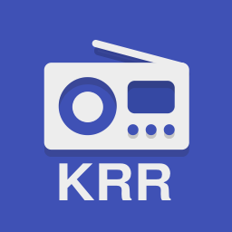

# krr-radio

KRR - Katolickie Rozgłośnie Radiowe (Android)

The KRR application uses the shared streams of broadcasters. Is not the sender of the content.

Contact: grz3chu(at)gmail.com

This application is free software licensed under the GPLv3 and uses the RadioDroid source code: (https://github.com/segler-alex/RadioDroid - author: segler_alex(at)web.de).

https://www.gnu.org/licenses/gpl-3.0.html
